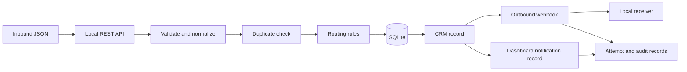

# Architecture and decision rules

All names, contacts, numbers, companies, and values in this repository are synthetic.

## Order of work

1. Authenticate the caller with a local bearer token.
2. Parse at most 32 KiB of JSON. Validate fields and return field-level errors.
3. Normalize names, email, phone, categories, money, and time.
4. Start a SQLite write transaction. Reject an existing `request_id` or `external_reference` with HTTP 409.
5. Match an existing customer only when email, company, name, and phone agree. Treat a phone-only or conflicting match as uncertain. Create a separate customer record and mark the request `needs_review`. Do not merge records.
6. Mark another request from the same customer and category within 24 hours for review.
7. Apply the first matching routing rule. Write the request and its first audit records in the same transaction.
8. Create a stored CRM event. Send it to the local receiver. Record each attempt and final state. Retry a timeout, connection error, malformed response, or HTTP 5xx response at most twice by default. Do not retry HTTP 4xx responses.
9. Create a structured internal dashboard notification record. This does not send email or SMS.

## Routing order

| First match | Team | Reason |
| --- | --- | --- |
| Uncertain duplicate | Operations | Human review |
| Billing request | Finance | Billing request |
| Urgent service request | Escalations | Urgent service |
| Existing customer | Account Management | Existing customer |
| New sales request above $25,000 | Senior Sales | Higher value sales request |
| Other sales request | Sales | Sales request |
| Other service request | Service | Service request |
| General inquiry | Operations | General inquiry |

Edit `src/northstar/rules.py` to change this order. The values are synthetic and illustrative.

## Storage

SQLite tables: `customers`, `requests`, `events`, `webhook_attempts`, and `audit_logs`. The request identifier and external reference have unique constraints. The event row stores the JSON sent to the receiver. The attempt table records each HTTP result without storing a secret.

## Demonstration boundary

The intake call sends the webhook before it returns. This makes the example easy to inspect. A production system would use a durable worker, a signed webhook, stronger authentication, and a controlled recovery process. The stored event is an example of the data such a worker would use. This project does not claim live CRM, email, scheduling, or accounting integration.

Retries can deliver the same event more than once if a receiver accepts an event but its acknowledgement is lost. A production receiver should use `event_id` to prevent duplicate effects.
